# Architecture review — s11 — 2026-09-01

**Scope**: Whole-repo deepening audit, weighted toward the recent hot spots
(`src/main.rs` opt driver, `src/search/llm/`, `src/search/symbolic/`,
`src/isa/x86.rs`, `src/capstone_bridge*.rs`, the auto whole-binary driver,
`src/semantics/`). Already-landed or in-flight seams were excluded from
candidacy (capstone-detail #800, indirect-target #799, output-path,
disassembly, x86 encodability family, sampler slot count #790).
**Picked**: `llm-search-stats-accumulator` — recorded `proposed`, **not implemented this firing** (blocked; see Pick).
**Degradations**: none — `gh` authenticated, sub-agent exploration available.

> **Diagram convention**: solid edges are the module interface a caller must
> learn; dashed edges are behaviour hidden inside the implementation.

## Candidates

### llm-search-stats-accumulator — pull LLM run accounting behind a tested seam  ·  Strong  ·  score 22/25

- **Files**: `src/search/llm/mod.rs:95` (`LlmSearch::search`, body 95–284); wraps the already-pure `src/search/llm/outcome.rs:37` (`classify`). File-count estimate: **~2** (`llm/mod.rs`, plus a new accountant struct — in `outcome.rs` or a sibling). No public/CLI surface: `SearchStatistics`/`LlmTimings`/`UnsupportedMnemonicLedger` are crate-internal.
- **Score 22/25** — leverage 4 (`classify` is unit-tested, but the counting rules that consume its verdict are reachable only through a full `FakeCodex` end-to-end run; a seam removes that whole class of test setup), locality 4 (every counting rule lands in one struct), blast radius 1 (contained, ≤3 files, no published interface), heat 5 (`llm/mod.rs` is in the repo's most active subsystem — last touched #794, with #793/#797/#798 adjacent).
- **Problem**: The textbook shallow-seam failure — *a pure function extracted for testability while the real bugs hide in how it is called*. `classify()` is pure and tested, but the ~190-line loop around it does all the accounting inline: mapping `(IterationOutcome, metrics)` onto `stats.smt_queries`, `candidates_evaluated`, `improvements_found`, `timings.smt_formula_bytes_max`, and `ledger.record(...)`, interleaved with verbose `eprintln!`. The rules are subtle — count `candidates_evaluated` only on Codex success, count a verification only when `metrics.is_some()`, count `smt_calls` only when `smt_called` — and none is reachable except through choreographed `FakeCodex` runs.
- **Deletion test**: CONCENTRATE. An `LlmRunAccounting { stats, timings, ledger }` with `record_codex_result` / `record_iteration(outcome, metrics)` gathers every counting rule into one unit-testable place; deleting it forces the rules back into the loop.
- **Solution**: Extract the accountant struct; the search loop keeps only control flow and verbose I/O and calls `record_*`. The accounting invariants then get direct table tests instead of end-to-end `FakeCodex` choreography.
- **Benefits**: Leverage — the subtle counting rules become directly assertable. Locality — a change to "how an outcome is counted" is a one-file edit. Test surface — the accounting moves from integration-only to unit-pinnable.

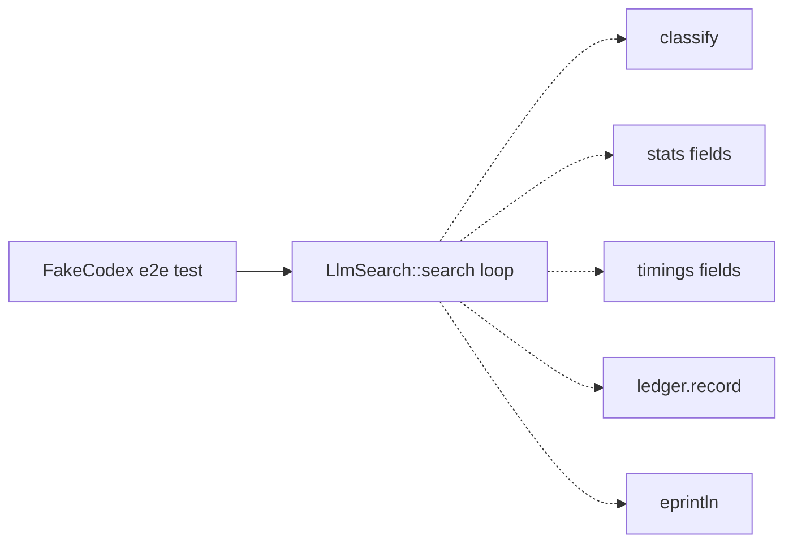

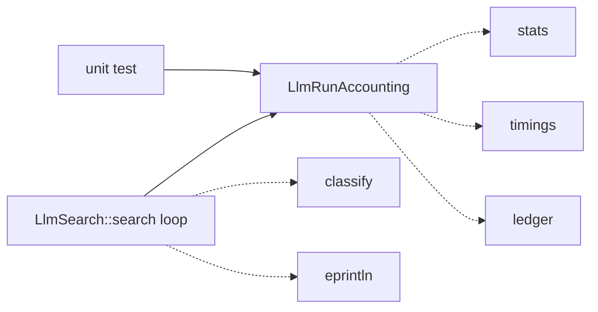

### opt-window-report-seam — give the opt path the report seam the equiv path already has  ·  Strong  ·  score 22/25

- **Files**: `src/main.rs:1762` (`optimize_elf_window_with_backend`, body 1762–1887), consumer `src/main.rs:1888` (`optimize_elf_binary_with_backend`); the pattern to mirror is `src/report.rs:200` (`build_equiv_report`). File-count estimate: **~2** (`main.rs`, `report.rs`). No CLI *flag* contract, but stdout wording is softly pinned by `tests/integration/opt_test.rs`.
- **Score 22/25** — leverage 4 (opens a real test surface on a currently-untested 125-line orchestrator, mirroring a proven in-repo seam), locality 4 (miss/improve/leave-unchanged branching + rendering land in one place), blast radius 1 (2 files, no published interface), heat 5 (`main.rs` is the hottest file in the repo, 226 commits; last touched #776).
- **Problem**: This 125-line function interleaves Capstone disassembly, IR conversion, validation, search dispatch, reassembly, cost computation, and ~11 inline `println!`s. The `equiv` path already routes rendering through the pure `build_equiv_report`; the `opt` path has no equivalent, so its rendering and control flow are fused and it has no direct unit test.
- **Deletion test**: CONCENTRATE. A `report::build_window_report(...)` returning a `WindowReport { lines, result }` pulls the "what happened to this window + what to print" decision into one tested place.
- **Solution**: Introduce a pure window-report builder paralleling `build_equiv_report`; the orchestrator returns data and a thin loop prints `report.lines`. Pins the wording the integration tests guard and makes the branching unit-testable.
- **Benefits**: Leverage — the untested orchestrator gains a unit-test surface. Locality — result-rendering concentrates in `report.rs`. Test surface — from integration-only to unit-pinnable.

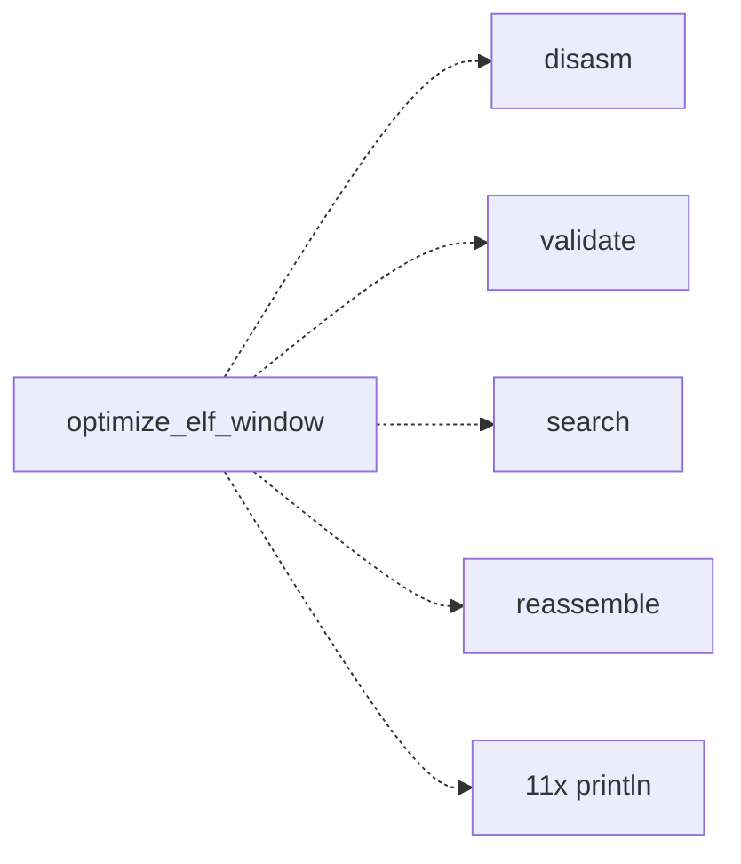

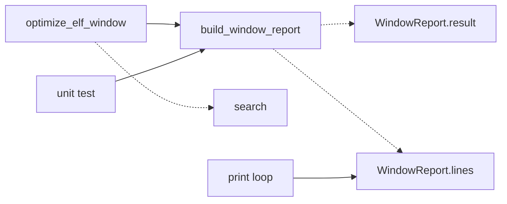

### elf-optimizer-engine-extraction — relocate the ELF optimization engine out of the driver  ·  Worth exploring  ·  score 22/25

- **Files**: `ElfOptimizationBackend` trait `src/main.rs:654` + both impls (726, 909), `optimize_elf_window_with_backend` (1762), `optimize_elf_binary_with_backend` (1888), `run_optimization` (2102), `run_x86_*` (2434+) → a new `src/elf_optimizer/` module; `src/lib.rs`. File-count estimate: **3–5**, plus a new `pub` crate module (additive).
- **Score 22/25** — leverage 5 (finally makes `main.rs` the thin adapter it is documented to be and narrows a wide/leaky trait), locality 5, blast radius 4 (crosses a tier seam: relocates ~2,000 lines and narrows an 11-method trait used by two backends), heat 5. **Ranks below the two seams above on the tie-break** (blast radius 4 vs 1).
- **Problem**: ~2,000 lines of the "thin adapter" is the engine. The trait is also a leaky seam — `optimization_context(&self, ir, patcher, section, end_addr, cs)` and `assemble_window(..., capstone_instructions, original_bytes, start_addr)` push `ElfPatcher`, `TextSection`, and raw `Capstone` handles across the backend boundary. Understanding one window flow means bouncing between the trait, two impls, the orchestrator, and the `run_x86_*` free functions.
- **Deletion test**: CONCENTRATE strongly — this is the core; extracting it is what makes `main.rs` the thin adapter it claims to be, in the spirit of ADR-0004's trait-collapse.
- **Solution**: Land the two internal seams above first, then relocate the trait + impls + orchestrators into `src/elf_optimizer/`, narrowing `optimization_context`/`assemble_window` to pass an already-decoded slice rather than raw Capstone. Best scheduled as a follow-on after the smaller seams carve the internal boundaries.
- **Benefits**: Leverage — the largest of any candidate. Locality — the whole window engine in one module. Test surface — the orchestrator becomes independently testable once relocated.

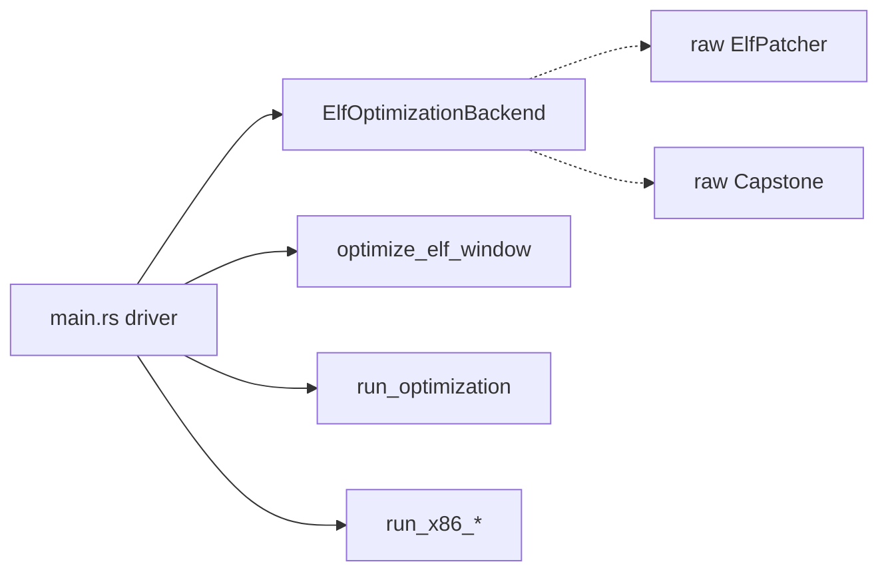

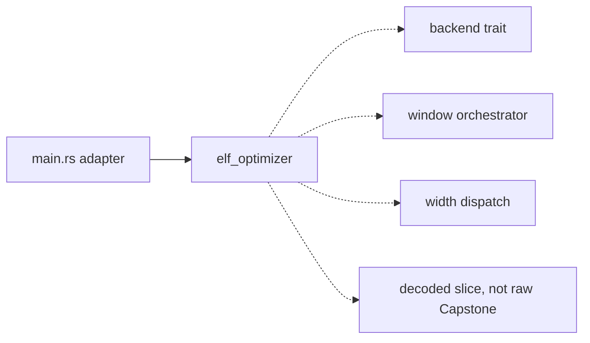

### x86-width-dispatch-runner — collapse the triplicated x86 width-dispatch spine  ·  Worth exploring  ·  score 19/25

- **Files**: `src/main.rs:2434` `run_x86_enumerative`, `:2480` `run_x86_stochastic`, `:2531` `run_x86_symbolic`; caller `src/main.rs:1023`. File-count estimate: **1**. No public surface.
- **Score 19/25** — leverage 3 (removes triplicated boilerplate; the three entry points remain as two-liners), locality 4, blast radius 1, heat 4.
- **Problem**: All three functions triplicate the same spine — build config → derive `live_out` → `if width == 32 { Search::<X86_32> } else { <X86_64> }` extract `(optimized, statistics)` → `print_search_statistics` → return — with an in-code comment apologizing that the two `SearchResultFor` types differ.
- **Deletion test**: CONCENTRATE. A generic `run_x86_width_dispatched<A: SearchAlgorithm>(...)` collapses the three copies.
- **Solution**: One generic helper (or small `X86Search` enum) owning the width branch, the result extraction, and the stats print; each `run_x86_*` becomes a two-line call. Already well pinned by ~10 tests, so the collapse is verifiable.
- **Benefits**: Leverage — dedup with a single verified dispatch. Locality — width handling in one place. Test surface — unchanged (already pinned), so low-risk.

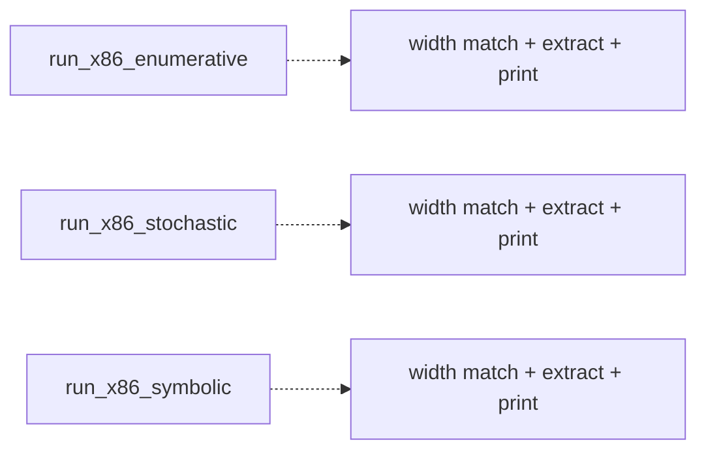

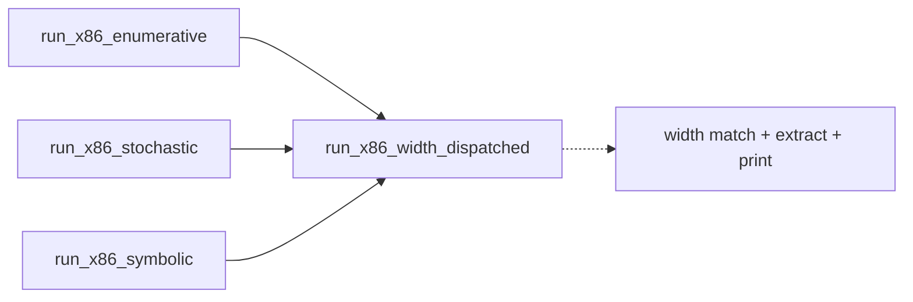

### search-config-builder-module — move the search-config builder family into search::config  ·  Worth exploring  ·  score 19/25

- **Files**: builders `src/main.rs:1960`–`:2100` + `:2422`; `OptimizationOptions` struct `src/main.rs:542`; target `src/search/config.rs`. File-count estimate: **~2–3**. Additive crate surface (`OptimizationOptions` becomes `pub`, new constructors on `SearchConfig`).
- **Score 19/25** — leverage 4 (consolidates 12 dispersed builders and is the anti-#243 guard — the bug where a builder silently dropped `--timeout`), locality 4, blast radius 2, heat 3.
- **Re-evaluation of the prior "coupling-blocked" flag**: **no longer blocked.** Every field of `OptimizationOptions` is already a `search::config` type; nothing ties it to `main.rs` but its location. The x86 builders' only extra deps (`isa::x86`, `x86_search_inputs`) are library modules. The family can move today without touching a CLI enum.
- **Deletion test**: CONCENTRATE — the builders pull weight (the anti-#243 guard); deleting them re-hand-rolls `SearchConfig` at each call.
- **Solution**: Move `OptimizationOptions` + the builder family into `search/config.rs` as `SearchConfig::for_aarch64(opts, regs, imms)` / `for_x86(...)`; unify the two near-identical base builders behind one register-pool parameter. Already pinned by builder tests, so relocation is low-risk.
- **Benefits**: Leverage — config construction owned by the config module. Locality — one home for the anti-#243 invariant. Test surface — tests relocate with the code.

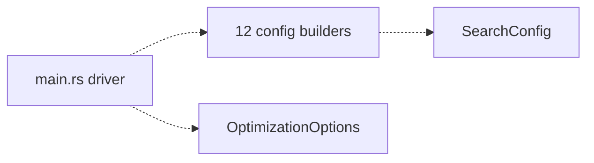

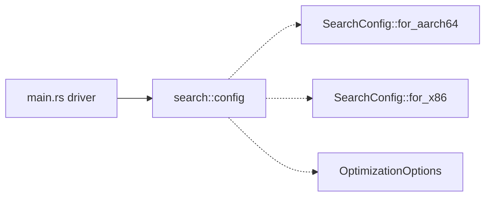

### arch-name-rendering — one arch-to-label seam  ·  Speculative  ·  score 14/25

- **Files**: `decode_arch_label` `src/main.rs:1723`, `arch_description` impls `src/main.rs:659` & `:916`, `CliArch: Display` (~200). File-count estimate: **~1–2**. No contract change.
- **Score 14/25** — leverage 2 (cosmetic dedup; callers do the same work), locality 2, blast radius 1, heat 3.
- **Problem**: Three parallel ways to turn an arch into a string that can drift.
- **Deletion test**: MOVE-ish — minor dedup, low leverage; a single `DetectedArch::label()` would fold them.
- **Solution**: Collapse to one label method. Low priority.

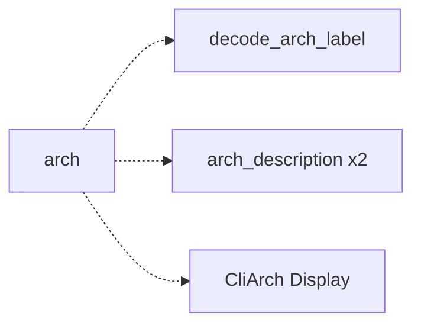

## Dropped

No candidate tripped a hard filter this run (every surviving candidate has leverage ≥ 2, blast radius ≤ 4, and contradicts no ADR). `resolve_opt_target` (`src/main.rs:441`) was **evaluated and not proposed**: it is already a clean, fully-pinned pure seam (8 table tests); its only "coupling" is that it speaks CLI-layer enums that legitimately live beside the clap definitions, so relocating it would be near-zero-leverage.

| Candidate | Dropped because |
|---|---|
| `resolve-opt-target-relocation` | Leverage ~1 — already a tested pure seam; moving it drags CLI enums for near-zero gain |

## Too large to automate

None. No candidate scored blast radius 5 (repo-wide rename/migration). `elf-optimizer-engine-extraction` (blast radius 4) is automatable as a single PR but is best sequenced *after* the two internal seams above.

## Pick

**`llm-search-stats-accumulator`** (22/25) is the deterministic pick. It ties
**`opt-window-report-seam`** (22/25) exactly — the two are **within 0 points**,
so the pick is close and the runner-up candidate is the natural next target.
The tie was broken deterministically per the rubric: lower blast radius (both 1,
tie) → higher heat (both 5, tie) → most-recently-touched file, where
`src/search/llm/mod.rs` (#794) is more recent than `src/main.rs` (#776).
`elf-optimizer-engine-extraction` also totals 22 but loses the first tie-break
key on blast radius (4 vs 1).

**This firing did not implement the pick.** Reconciliation found PR **#800**
(*"refactor(auto): extract Capstone detail inspection into a pure tested seam"*,
branch `sym/s11/routine/refactor-audit/01M104XQDM`) **open and unmerged** — an
in-flight architecture-deepening PR from the immediately-preceding firing of
this same `refactor-audit` routine. The skill's rule is **one architecture PR at
a time; a second concurrent architecture PR is unreviewable**. Rather than stack
a second one, this run stops before design/implementation, records every
candidate in `.architecture/backlog.md` as `proposed` (and #800 as `in-flight`),
commits and pushes this report and the backlog, and leaves the pick for the next
firing after #800 merges. See the Run log in `.architecture/backlog.md`.

## Design

No design pass ran. Implementation was blocked by the open in-flight
architecture PR #800 (one-architecture-PR-at-a-time), so the run stopped at
step 2 before the design-it-twice pass. The next firing (once #800 has merged)
should begin the design pass from the `llm-search-stats-accumulator` pick above,
or from `opt-window-report-seam` if it then reconciles as the top surviving
candidate.
