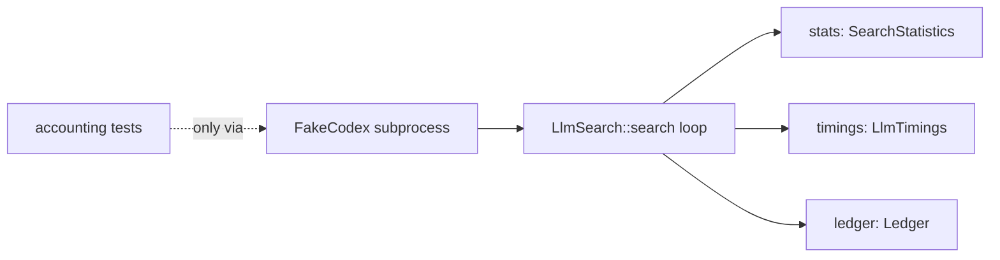
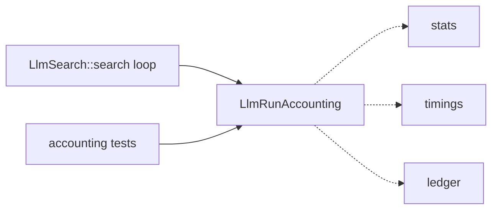
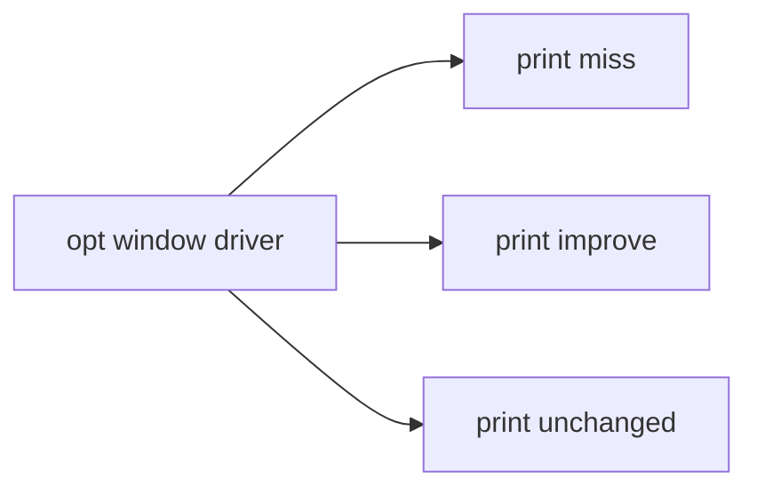
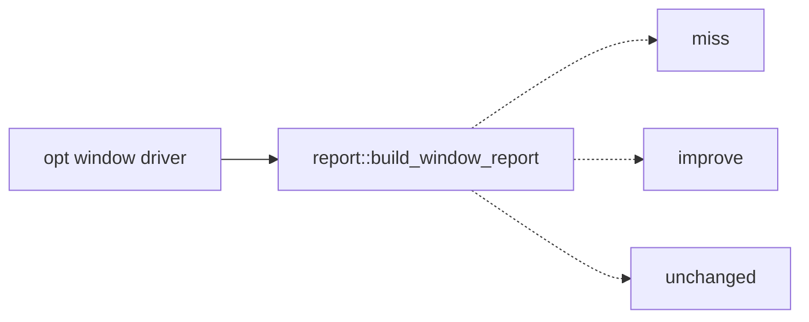

# Architecture review — s11 — 2026-09-02

**Scope**: Hot-spot–weighted scan of the whole tree, reconciled against the
persisted backlog recovered from branch `pm-deepen/run-2026-09-01-0107`
(`.architecture/` is absent from `origin/main`; see the backlog provenance note).
Because the prior firing (2026-09-01) already scored this tree deterministically
and only PR #800 has landed since — touching the auto driver in `src/main.rs`,
not the LLM search or the `opt` window paths — a full fresh sub-agent sweep was
**deliberately not re-run**: it would risk inventing new slugs and breaking
cross-run dedup, which the routine's determinism depends on. Instead the prior
candidates were re-verified against the current tree and re-ranked. The two
top-scoring candidates' modules are unchanged since scoring, so the pick is
stable.

**Picked**: `llm-search-stats-accumulator` — see PR (linked from the backlog) and `.architecture/backlog.md`.

**Degradations**: Backlog memory recovered from the unmerged branch
`pm-deepen/run-2026-09-01-0107` rather than `origin/main`, because PR #800 merged
without carrying `.architecture/`. This PR carries `.architecture/` so the memory
finally lands on `main`. No other degradations: `gh` authenticated, quality gate
discoverable, sub-agents available.

**Diagram legend**: solid edges are the interface a caller sees; dashed edges are
inside the implementation, behind the seam.

## Candidates

### llm-search-stats-accumulator — extract LLM search-run accounting into a tested seam  ·  Strong  ·  score 22/25

- **Files**: `src/search/llm/mod.rs:95` (`LlmSearch::search`, the loop that scatters the accounting), `src/search/llm/outcome.rs:37` (`classify`, source of the `EquivalenceMetrics` the accounting consumes). New `src/search/llm/accounting.rs`. **File-count estimate: 2** (new `accounting.rs` + edits to `mod.rs`; `LlmTimings` re-exported from `mod.rs` so `report.rs`/`main.rs` are untouched).
- **Score**: 22/25
  - **Leverage 4** — removes a whole class of test setup: every accounting assertion today must spin up a `FakeCodex` subprocess (`#[cfg(unix)]`), so the counting rules are only reachable end-to-end. Behind a seam they become direct, platform-independent unit tests.
  - **Locality 4** — the counting rules (which event increments which counter) currently live smeared across ~120 lines of the search loop; afterwards they concentrate in one file. A change to a counting rule becomes a one-file edit.
  - **Blast radius 1** — contained: no published interface changes. `LlmTimings` stays reachable as `crate::search::llm::LlmTimings` via re-export; `LlmSearch::{timings,ledger,statistics,reset}` are unchanged.
  - **Heat 5** — `src/search/llm/` is among the hottest areas: #793, #794, #797, #798 all landed recently.
- **Problem**: `LlmSearch::search` is a **shallow orchestrator wrapped around a deep accounting responsibility that has no interface of its own**. Three accumulators — `SearchStatistics`, `LlmTimings`, `UnsupportedMnemonicLedger` — are mutated inline at eight+ sites across the loop, each governed by a subtle rule: `codex_calls` counts every attempt but `candidates_evaluated` only counts a Codex `Ok`; the SMT counters (`smt_calls`, `smt_queries`, `smt_formula_bytes_total/_max`) are driven by the *metrics* event, not the *outcome* event, so an `EquivUnknown` with `smt_called: true` still bumps `smt_calls` while contributing zero formula bytes; `Success` alone touches four counters at once. None of this is unit-testable — the tests in `mod.rs` prove it, every one routing through `FakeCodex`.
- **Deletion test**: delete the seam and the counting logic doesn't vanish — it floods back into the search loop exactly as it is today. Complexity **concentrates** in the seam rather than moving to callers. Passes.
- **Solution**: introduce `LlmRunAccounting`, a struct owning the three accumulators, constructed with the target length and fed one method call per loop event: `record_codex_attempt(elapsed)`, `record_codex_success()`, `record_verification(&EquivalenceMetrics, elapsed)`, `record_outcome(&IterationOutcome)`, and `finish(elapsed) -> (SearchStatistics, UnsupportedMnemonicLedger, LlmTimings)`. The search loop keeps the control flow and delegates all counting; the rules become assertable by constructing the struct and feeding synthetic events.
- **Benefits**: **Leverage** — the FakeCodex subprocess dance is no longer the only way to assert a counting rule; new rules get cheap, exhaustive, cross-platform tests. **Locality** — one file owns the counting; the search loop reads as control flow, not bookkeeping. **Test surface** — the interface *is* the test surface: every counter transition is exercised directly through `record_*`, including the two rules the loop encodes non-obviously (metrics-vs-outcome SMT counting; Codex-error-counts-call-but-not-evaluation).
- **Before / After**

- **Recommendation strength**: Strong.

### opt-window-report-seam — pure build_window_report for the opt path  ·  Worth exploring  ·  score 22/25

- **Files**: `src/main.rs:1762` (approx, pre-#800; the `opt` window orchestrator), `src/report.rs:200`. Estimate ~2.
- **Score**: 22/25 (leverage 4, locality 4, blast radius 1, heat 5). Justifications carried from the 2026-09-01 scoring; modules unchanged since.
- **Problem**: the `opt` window path prints ~11 inline results and branches over miss/improve/leave-unchanged inside a 125-line orchestrator with no seam, so none of that branching is unit-testable — unlike the `equiv` path, which already has `build_equiv_report`.
- **Deletion test**: passes — a `build_window_report` seam concentrates the rendering/branching logic; deleting it pushes the branching back inline.
- **Solution**: mirror the `equiv` path — a pure `report::build_window_report` returning a structured result the driver prints.
- **Benefits**: parity with the tested `equiv` path; the window branching becomes unit-pinnable.
- **Before / After**

- **Recommendation strength**: Worth exploring (runner-up candidate; natural next firing).

### elf-optimizer-engine-extraction — relocate the ELF optimization engine out of main.rs  ·  Worth exploring  ·  score 22/25

- **Files**: `src/main.rs:654` (approx, pre-#800), `src/lib.rs`, new `src/elf_optimizer/`. Estimate 3–5.
- **Score**: 22/25 (leverage 5, locality 5, blast radius **4**, heat 5).
- **Problem**: ~2,000 lines of ELF optimization engine live in `main.rs`; the `optimization_context`/`assemble_window` trait methods leak raw Capstone across the seam.
- **Deletion test**: passes strongly — this is the deepest candidate. But blast radius 4 (crosses into a published module layout and touches many call sites) keeps it below the two blast-radius-1 seams on the score. Best sequenced *after* the smaller internal seams.
- **Recommendation strength**: Worth exploring — but this is the largest one-PR candidate the routine will attempt; a human may prefer to schedule it.

### x86-width-dispatch-runner  ·  Speculative  ·  score 19/25

Collapse the triplicated width-dispatch spine of `run_x86_enumerative/stochastic/symbolic` into one generic helper. Leverage 3, locality 4, blast radius 1, heat 4. Modules approx pre-#800.

### search-config-builder-module  ·  Speculative  ·  score 19/25

Move `OptimizationOptions` and the search-config builder family into `search/config.rs`. Leverage 4, locality 4, blast radius 2, heat 3.

### arch-name-rendering  ·  Speculative  ·  score 14/25

Collapse three parallel arch-to-string paths into a single `DetectedArch::label()`. Leverage 2, locality 2, blast radius 1, heat 3. Low priority.

## Dropped

| Candidate | Dropped because |
|---|---|
| `resolve-opt-target-relocation` | Leverage ~1 — already a clean, fully-pinned pure seam (8 table tests); its only coupling is to CLI-layer enums that legitimately live beside the clap definitions, so relocating it is near-zero leverage. Fails the deletion test (complexity would move, not concentrate). Re-check if those enums move. |

## Too large to automate

None this firing. `elf-optimizer-engine-extraction` (blast radius 4) is large but still one-PR-eligible; it is *not* blast radius 5, so it stays in the ranked candidate list rather than here. If a future re-score raises its blast radius to 5, move it here.

## Pick

**`llm-search-stats-accumulator`**, 22/25.

It tied at 22/25 with `opt-window-report-seam` and `elf-optimizer-engine-extraction`. The tie-break (ranking.md) is: lower blast radius, then higher heat, then most-recently-touched files.

- `elf-optimizer-engine-extraction` loses immediately on blast radius (4 vs 1).
- `opt-window-report-seam` ties on blast radius (1) and heat (5); it loses on the final tie-break — the LLM files were touched more recently (#797/#798, both post-dating report.rs's last change #743).

The top two are **within 1 point** (in fact tied, 22 = 22): this was a close pick, and `opt-window-report-seam` is the natural next firing. The pick is recorded as a decision here rather than put to a user.

The prior firing (2026-09-01) already selected this same candidate but could not implement it — PR #800 was an open in-flight architecture PR, and the routine allows one at a time. #800 has since merged, clearing the block, so this firing implements the standing pick.

## Design

Three interfaces were produced by parallel design agents (design-it-twice), then
adjudicated by a separate agent that authored none of them, against the fixed
criteria in priority order: depth, locality, seam placement, test surface, blast
radius.

All three agreed on the seam boundary: a new `src/search/llm/accounting.rs` that
owns the three accumulators; `LlmTimings` moves there and is re-exported from
`mod.rs` (`pub use`) so `crate::search::llm::LlmTimings` stays valid and
`report.rs`/`main.rs` are untouched; the 10 `FakeCodex` `#[cfg(unix)]` tests stay
as the protocol oracle; and `SearchStatistics::record_verification` is **not**
reused (it folds `smt_elapsed` and bumps `candidates_passed_fast` on a different
condition, which would break the counts bit-for-bit).

### Design A — minimal surface (WINNER)

`RunAccounting` with `new(target_len)`, one `record(RunEvent)` method, and
`finish(elapsed) -> RunTotals`. `RunEvent` is a two-variant enum:
`Codex { elapsed, produced: bool }` and
`Candidate { outcome: &IterationOutcome, metrics: Option<&EquivalenceMetrics>, elapsed }`.
All branching (Ok/Err, metrics-present, the five-way outcome, the SMT
bytes total/max) lives inside `record`. The caller emits two events per
iteration and keeps its own control flow, `Instant`, and verbose logging.

### Design B — event-per-method (loser)

Six methods (`begin`, `record_codex_attempt`, `record_codex_success`,
`record_verification(Option<&metrics>, elapsed)`, `record_outcome(&outcome)`,
`finish`), each mapping ~1:1 to one counting rule. Lost on **depth**: near-zero
leverage — each method is a thin setter, so the inline code is merely relocated
behind five call sites, and the orchestration (which method, in what order) stays
in the loop.

### Design C — common-caller / closure-wrapping (runner-up design)

`RunAccounting` owns the accumulators *and* the run clock; `record_codex(closure)`
and `record_verification(closure)` wrap the real operations so the seam captures
timing itself, and `finish() -> RunTotals`. Hides the most behaviour, but lost on
**seam placement** (criterion 3, the decisive one): it manufactures a
*hypothetical* seam — a generic error type `E` with exactly one production
instantiation (`CodexError`) — and *leaks* the run clock via `started()`, which
the loop still needs for `remaining_until`/timeout math. Its headline advantage
(closures make timing impossible to order wrongly) targets wall-clock timing, which is
outside the goal: the subtle, currently-untestable rules are the discrete
*counters*, which Design A localizes just as completely with a smaller, tighter
surface and a smaller diff.

### Verdict

**Winner: Design A**, with one adjustment folded in from Design C: `finish`
returns a named `RunTotals { stats, ledger, timings }` struct rather than a bare
tuple, removing positional-destructuring risk at the single call site at zero
extra blast radius. Design C's clock ownership is explicitly **not** folded in —
`new(target_len)` seeds the accumulators and `finish(elapsed)` accepts the
caller-measured span, so the `Instant` stays in the loop and C's `started()` leak
never materializes.

**Runner-up design: Design C.** Decisive criterion: seam placement — A puts the
seam at the real per-iteration data boundary (the `RunEvent` value is built
identically by the production loop and by the unit tests, two authentic
adapters), whereas C adds abstraction without a corresponding variation point.

### Watch-items carried into implementation

- `candidates_evaluated` rides on `Codex { produced: true }` only — not on `Err`,
  and not on the timeout-break-before-codex path (no event emitted there). This
  keeps the zero-solver-budget case at `candidates_evaluated = 1, verifications = 0`.
- SMT counters (`smt_calls`, `smt_queries`, formula bytes) are driven by
  `metrics.smt_called`, independent of the outcome variant.
- `RunEvent::Candidate` borrows the outcome (`&IterationOutcome`), so the loop can
  still move the owned `Success(seq)` into `found` after `record` returns.
- The start-of-run `self.last_* = default()` reset stays in the caller; the seam
  replaces only the local accumulators.
