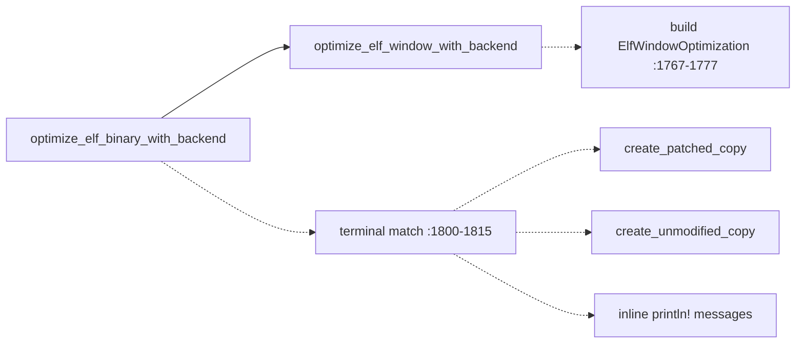
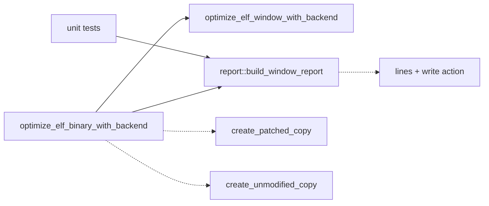

# Architecture review — s11 — 2026-09-03

**Scope**: The `opt` (single-window ELF optimization) driver path in `src/main.rs`, plus a hot-spot sweep of `src/search/llm/`, `src/parser/`, `src/report.rs`, `src/search/result.rs`, and `src/semantics/`. Scoped by heat: `main.rs` and `src/parser/mod.rs` dominate recent commits; the reconciled backlog already tracks the driver seams.
**Picked**: `opt-window-report-seam` — see the PR and `.architecture/backlog.md`.
**Degradations**: none. `gh` authenticated; sub-agent exploration and design-it-twice both available.

In the Mermaid diagrams below, **solid edges are the interface** (a caller reaching a seam) and **dashed edges are inside the implementation** (a seam reaching its private steps).

## Candidates

### opt-window-report-seam — pure `build_window_report` seam for the `opt` write decision  ·  Strong  ·  score 22/25

- **Files**: `src/main.rs:1654` (`optimize_elf_window_with_backend`, the ~125-line window orchestrator that builds `ElfWindowOptimization`), `src/main.rs:1780` (`optimize_elf_binary_with_backend`, the terminal `match` at `:1800`–1815 that acts on it), `src/main.rs:563`/`:568` (bin-local `OptimizedWindowBytes`/`ElfWindowOptimization`); mirror model `src/report.rs:200` (`build_equiv_report`). **File-count estimate: 2–3** — `report.rs` is a lib module and `ElfWindowOptimization` is bin-local, so the outcome type must move into the lib (a plausible 3rd file) before `report.rs` can consume it.
- **Score**: 22/25
  - **Leverage 4** — the untested three-way write decision (`Improved` → patch replacement; `NoImprovement{Some}` → patch reassembled; `NoImprovement{None}` → unmodified copy) and its "Created optimized/unchanged binary" messages become unit-pinnable without running the `opt` binary; the `equiv` path already proved this pays off (`build_equiv_report`). Not 5: it concentrates one decision, it does not remove a whole class of test setup across many callers.
  - **Locality 4** — the classification and its messages move from two functions into one pure seam; a future change to the write policy or message wording becomes a one-file edit in `report.rs`.
  - **Blast radius 1** — no published interface changes; the CLI stdout contract is preserved byte-for-byte. Estimate 2–3 files.
  - **Heat 5** — `src/main.rs` is the hottest file in the tree (touched in essentially every recent driver-refactor PR, last 2026-09-01).
- **Problem**: The `opt` path's terminal outcome is a shallow, untested orchestrator. `optimize_elf_window_with_backend` builds an `ElfWindowOptimization` at `:1767`–1777, and `optimize_elf_binary_with_backend` then re-matches the same three cases at `:1800`–1815 to choose a patcher call *and* a stdout message. The decision — which is genuinely branchy (improve vs reassembled-miss vs leave-unchanged, plus the "backend reported an optimization but refused to assemble" error arm) — is reachable only by running the whole binary end-to-end, exactly the shape `build_equiv_report` was extracted to fix for `equiv`. The interface here (a bin-local enum) is nearly as complex as the tiny amount of logic wrapping it, and the logic is split across two functions.
- **Deletion test**: Deleting the terminal `match` would force each caller to re-derive the write-action-and-message mapping inline — complexity **concentrates** in a `report::build_window_report` seam rather than scattering. Passes.
- **Solution**: Relocate `ElfWindowOptimization` (and `OptimizedWindowBytes`) into the lib. Add `report::build_window_report(outcome, output_path) -> WindowReport { lines, action }`, where `action` names the write to perform (patch these bytes / leave unchanged) and `lines` are the messages to print on success. `optimize_elf_binary_with_backend` calls the seam, performs the named patcher I/O, then prints the lines — preserving the current "print after successful write" ordering and the exact strings the integration tests assert (`"Created optimized binary"`, `"Created unchanged binary"`). The progress prints interleaved with disassembly/search (`:1663`–1714, `:1741` `no_optimization_message`) stay in place; they are a function of the run, not the outcome.
- **Benefits**: **Leverage** — the write decision + messages gain a unit test surface, closing the gap the `equiv` path already closed. **Locality** — write-policy and message changes concentrate in `report.rs`. **Test surface** — the previously binary-only miss/improve/unchanged branches (and the assemble-refusal error) become table-testable pure-function cases.
- **Before / After**:

Above: the outcome classification lives in one function, the write-and-message decision in another, and neither is reachable without running the binary.

Below: one pure seam owns the classification, the write action, and the messages; the caller performs I/O; unit tests reach the decision directly.

## Dropped

| Candidate | Dropped because |
|---|---|
| `resolve-opt-target-relocation` | Leverage ~1 — already a clean, fully-pinned pure seam (8 table tests); its only coupling is to CLI-layer enums that legitimately live beside the clap definitions. Re-check if those enums move (2026-09-03: they have not). |

## Too large to automate

None this firing. `elf-optimizer-engine-extraction` (blast radius 4, ~2,000 lines out of `main.rs`) is large but **not** blast-radius 5, so it stays an eligible `proposed` candidate — it is the tied runner-up, deferred behind the two smaller internal seams rather than excluded.

## Pick

**`opt-window-report-seam`** (22/25). The runner-up **candidate** is **`elf-optimizer-engine-extraction`**, also 22/25 — the top two are tied within 0 points, so the runner-up is the natural next firing. The tie broke on **lower blast radius**: `opt-window-report-seam` touches 2–3 files behind no published interface (blast 1); `elf-optimizer-engine-extraction` relocates ~2,000 lines across a package seam (blast 4). Per the rubric, lower blast radius wins the tie, and a contained seam is the right first move before the larger relocation.

Three fresh candidates surfaced this firing scored below the pick and were added to the backlog as `proposed`, not taken:

- `aarch64-parser-arity-combinators` (19/25) collapses ~49 copy-pasted arity prologues and ~12 sibling parsers in `src/parser/mod.rs`. Its raw duplication is the highest in the tree and its heat is 5 (not "cold" — the Explore agent misread the log; the file was touched 2026-09-01 and appears in ~108 of the last 120 commits), but its **leverage is 2**: `parse_line`'s public interface does not change, callers gain nothing, and behaviour is already pinned end-to-end so the test surface barely improves. It is implementation-internal DRY inside an already-deep module — a `pm-simplify` job more than a deepening one. A second, independent reason to keep the established pick: the routine's scoring is deliberately deterministic so consecutive firings dedup against this backlog, and overriding the persisted pick on a fresh candidate whose margin would rest on a single judgment-call axis (leverage 2 vs a generous 3) is exactly the drift that determinism exists to prevent.
- `search-result-optimized-accessor` (19/25) removes a redundant `found_optimization: bool` that always equals `optimized_sequence.is_some()` and unifies 8 re-derivation sites; leans type-design/simplification.
- `opt-target-arch-mismatch-classifier` (19/25) de-stringly-types the arch-mismatch error re-dispatch and pulls the inline RISC-V pre-dispatch peek into a table-testable classifier; leverage diluted by overlap with `arch-name-rendering` and the dropped `resolve-opt-target-relocation`.

## Design

_Written in step 4, after this report was first committed._
