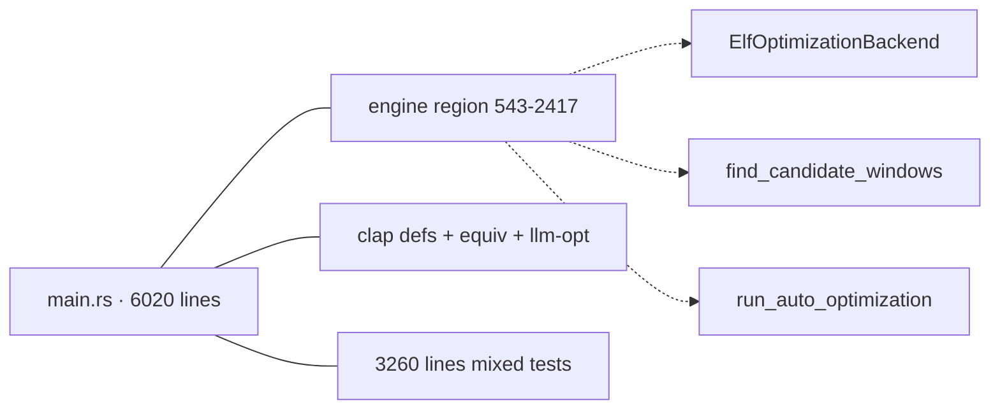
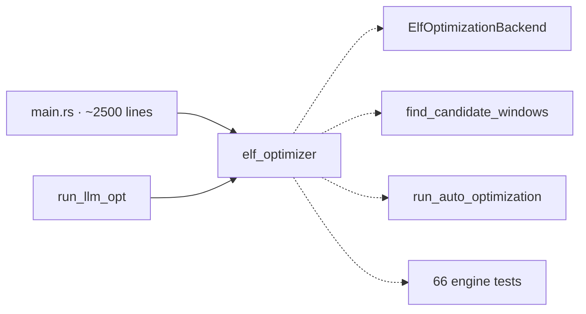
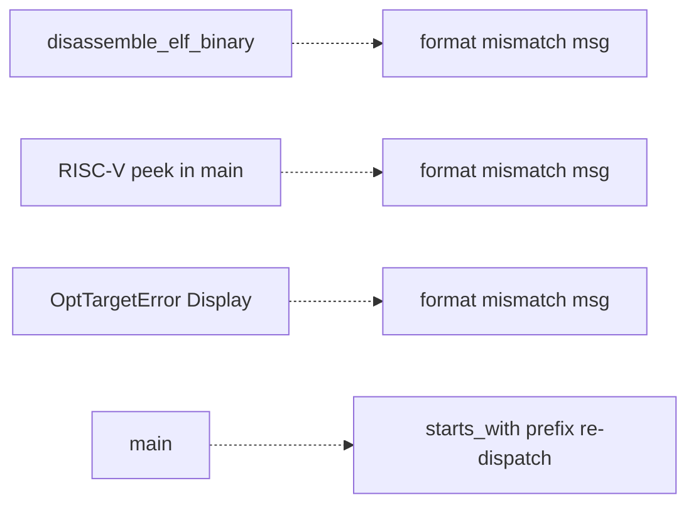
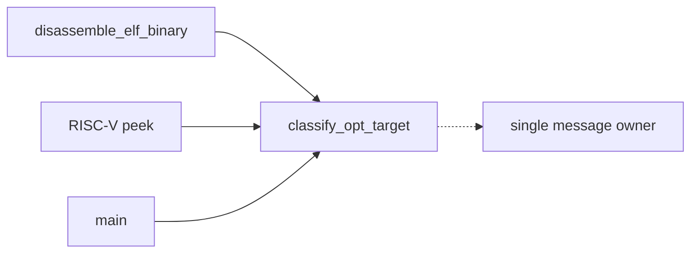

# Architecture review — s11 — 2026-09-04

**Scope**: Whole-repo scan weighted to the hot spots of the last 60 commits.
`src/main.rs` dominates (22 of 60 commits, 6020 lines) and hosts every top
backlog candidate, so the scan concentrated there, then swept the other hot
files (`src/isa/x86/mod.rs`, `src/parser/x86.rs`, `src/search/**`,
`src/report.rs`). Branch created from `origin/main` (adoption of the firing
branch `sym/s11/routine/refactor-audit/01M1MR2N0C` refused: condition 3 failed —
it had an upstream set to `origin/main`), renamed from
`pm-deepen/run-2026-09-04-0102` to `pm-deepen/elf-optimizer-engine-extraction` at
step 2.
**Picked**: `elf-optimizer-engine-extraction` — see the PR and `.architecture/backlog.md`.
**Degradations**: none. `gh` authenticated; sub-agents available.

Diagram convention: **solid edges are the interface** a caller must learn;
**dashed edges are inside the implementation** and invisible to callers.

## Candidates

### elf-optimizer-engine-extraction — relocate the ELF opt engine into a deep lib module · Strong · score 22/25

- **Files** — `src/main.rs:543`–`:2417` (the ~1875-line engine block: trait
  `ElfOptimizationBackend` `:606`, `AArch64OptimizationBackend` `:678`,
  `X86OptimizationBackend` `:847`, `find_candidate_windows*` `:1111/:1125/:1136`,
  `run_auto_optimization*` `:1459/:1495`, `optimize_elf_binary*`
  `:1579/:1610/:1736`, `run_optimization` `:1947`, `run_x86_*`
  `:2279/:2325/:2376`, the `build_*_search_config` family `:1805`–`:2278`, the
  `print_*` helpers `:2110`–`:2131`, `convert_to_ir` `:2198`,
  `optimization_context_for_backend` `:2220`); `src/lib.rs` (add `pub mod
  elf_optimizer;`); new `src/elf_optimizer/`. **File-count estimate: 3.**
- **Score — 22/25** (leverage 5, locality 5, blast radius 4, heat 5)
  - *Leverage 5*: the engine currently has **no interface** — it is inlined into
    the binary crate, so its 66 unit tests can only reach it as private siblings
    of `fn main`, and no other consumer can see it at all. Behind a module it
    exposes a **6-item interface** (`OptimizationOptions`,
    `run_auto_optimization`, `optimize_elf_binary`, and the three `print_*`
    helpers `run_llm_opt` shares) that hides ~1875 lines. That is the
    depth ratio the whole exercise exists to create, and it removes a whole class
    of "reachable only through the compiled binary" test setup.
  - *Locality 5*: today a change to the opt pipeline forces edits interleaved
    with CLI parsing, the `equiv`/`llm` paths, and 3260 lines of mixed tests in
    one 6020-line file; afterwards it is a one-module edit with its own test
    suite.
  - *Blast radius 4*: crosses the bin→lib tier seam and adds to the lib's
    published module surface. By file count it is only 3 files, but the band
    description (crosses a package/tier seam) wins over the range.
  - *Heat 5*: `src/main.rs` is the hottest file in the repo (22/60 commits);
    `bae727a (#819)` patched inside the X86 backend on 2026-09-03.
- **Problem** — The engine is a **shallow region, not a module**: ~1875 lines of
  orchestration with an interface as wide as its implementation, because there is
  no interface at all — every function is a private sibling of `main`. A reader
  or an AI navigating "how does `s11 opt` work" must page through a 6020-line file
  that also contains clap definitions, the `equiv` and `llm-opt` commands, and
  3260 lines of tests. The engine's tests can only run as `#[cfg(test)]` siblings
  of `main`, so the pipeline is not independently exercisable.
- **Deletion test** — Deleting the region would force the whole opt-binary
  pipeline to be re-implemented; the complexity **concentrates** behind a small
  interface rather than moving to callers. `main` learns 6 items instead of 1875
  lines. Passes.
- **Solution** — Move the engine block into `src/elf_optimizer/` as a lib module,
  carrying its 66 engine-only tests into the module's own `#[cfg(test)] mod
  tests` (they access engine internals as siblings, so nothing extra becomes
  `pub`). Export only the 6-item caller surface. `main`, `run_llm_opt` import
  from `s11::elf_optimizer`. `run_equiv` and the 27 CLI-only tests stay in
  `main.rs`. The engine references **zero** CLI-layer types (verified by closure:
  no `Args`, `SupportedArch`, `OptTargetError`, `resolve_opt_target`, or any clap
  `ValueEnum` appears in `543`–`2417`), so the move is clean. A follow-on,
  evaluated in `## Design`, narrows the two leaky trait methods that still take
  raw Capstone (`optimization_context(…, cs: &Capstone)` `:643`,
  `assemble_window(…, capstone_instructions: &Instructions, …)` `:667`).
- **Benefits** — *Leverage*: one navigable module with a 6-function interface in
  place of an inlined 1875-line region. *Locality*: opt-pipeline change, bugs,
  and verification concentrate in `src/elf_optimizer/`. *Test surface*: the 66
  engine tests become a lib test suite exercisable without the binary — the
  interface becomes the test surface.
- **Before / After**

### opt-target-arch-mismatch-classifier — one owner for the arch-mismatch decision · Worth exploring · score 19/25

- **Files** — `src/main.rs:418` (`OptTargetError::ArchMismatch` Display), `:501`
  (`disassemble_elf_binary`), `:2604`–`:2632` (inline RISC-V pre-dispatch peek,
  three `std::process::exit`), `:2566` (`message.starts_with(ARCH_MISMATCH_PREFIX)`
  re-dispatch), `:385` (`ARCH_MISMATCH_PREFIX`), `:442` (`resolve_opt_target`).
  **File-count estimate: 1.**
- **Score — 19/25** (leverage 3, locality 3, blast radius 1, heat 5). Runner-up
  candidate this firing (see *Pick*).
- **Problem** — The arch-mismatch message is built at three sites and `main`
  re-classifies errors by matching on their wording; the RISC-V pre-dispatch peek
  re-reads the ELF header and formats its own decision inline, contradicting the
  `:2641` comment that "every pre-dispatch policy rule lives behind
  `resolve_opt_target`".
- **Deletion test** — Passes: a `classify_opt_target(requested, e_machine)` seam
  concentrates the cross-check decision and gives the message one owner.
- **Solution** — Unify behind one pure `classify_opt_target` returning
  `Result<SupportedArch, OptTargetError>`, table-testable like `resolve_opt_target`.
- **Benefits** — *Locality*: the mismatch decision + message get one home.
  *Test surface*: the RISC-V/mismatch policy becomes table-testable rather than
  reachable only through the CLI arm.
- **Before / After**

### x86-width-dispatch-runner — collapse the triplicated width-dispatch spine · Worth exploring · score 19/25

- **Files** — `src/main.rs:2279/:2325/:2376` (`run_x86_enumerative/stochastic/symbolic`); the asymmetric early-return guard is at `:2336`–`:2338`, absent from the other two. **File-count estimate: 1.**
- **Score — 19/25** (leverage 3, locality 4, blast radius 1, heat 4).
- **Problem** — Three functions triplicate the `if width == 32 { … } else { … }` spine; the guard drift is a latent-bug signal a shared seam would have prevented.
- **Deletion test** — Passes: one `run_x86_width_dispatched<A: SearchAlgorithm>` concentrates the spine.
- **Solution / Benefits** — Generic width-dispatch helper; *locality* rises to 4 (the guard lives once).

### search-config-builder-module — home the search-config builders beside their types · Worth exploring · score 19/25

- **Files** — `src/main.rs:543` (`OptimizationOptions`), the 10 `build_*_search_config` fns `:1805`–`:2278`; `src/search/config.rs` (home). **File-count estimate: 2–3.**
- **Score — 19/25** (leverage 4, locality 4, blast radius 2, heat 3). Naturally sequenced *after* the pick: `OptimizationOptions` is the pick's sole caller-constructed type, so extracting it independently would collide.
- **Problem / Solution** — `OptimizationOptions` + 10 builders live in the driver though every field is already a `search::config` type; move to `SearchConfig::for_aarch64`/`for_x86` constructors.

### search-result-optimized-accessor — collapse a redundant bool invariant · Worth exploring · score 19/25

- **Files** — `src/search/result.rs:13/:67` (`found_optimization: bool` beside `optimized_sequence: Option<..>`); re-derivers in `src/main.rs` (`run_optimization` arms, x86 runners) and lib-side `src/search/parallel/coordinator.rs:338/:373`. **File-count estimate: 2–3.**
- **Score — 19/25** (leverage 4, locality 4, blast radius 2, heat 3).
- **Problem / Solution** — `found_optimization == optimized_sequence.is_some()` by construction, yet ~10 sites re-derive it; add `optimized_if_found()` accessor and keep the field readable (many test asserts read it directly). Leans type-design/simplification, so leverage is 4 not 5.

### cli-error-exit-seam — one exit/message-policy owner for main · Worth exploring · score 20/25 · fresh

- **Files** — `src/main.rs:2545`–`:2758` (`fn main`: 15 `std::process::exit` + 15 `eprintln!` paired inline across every command arm). **File-count estimate: 1.**
- **Score — 20/25** (leverage 3, locality 4, blast radius 1, heat 5)
  - *Leverage 3*: framing handlers as `Commands::run(self) -> Result<(), CliError>` with one exit-mapping site removes a class of "run the binary to observe an exit code" setup; one primary caller (`main`).
  - *Locality 4*: exit-code + message policy, today scattered across ~15 sites with no owner, becomes one table-testable site.
  - *Blast radius 1*: one file, no published-interface change.
  - *Heat 5*: `main.rs` is the hottest file.
- **Problem** — The error→exit-code policy has no owner; none of it is reachable except by running `s11`. Partially subsumes `opt-target-arch-mismatch-classifier`'s exit paths (`:2620/:2624/:2629`).
- **Deletion test** — Passes: centralizes a diffuse policy behind one mapping.
- **Solution / Benefits** — `Commands::run` returning a `CliError`, mapped once in `main`; the exit/message table becomes pinnable via the repo's integration-test binaries.

### x86-parser-mnemonic-dispatch-decomposition — split the x86 mnemonic mega-fn · Speculative · score 17/25 · fresh

- **Files** — `src/parser/x86.rs:361`–`:731` (`x86_ir_from_mnemonic_impl`, one ~370-line sequential `if mnemonic == …` dispatch that re-implements arity + width checks inline per family). **File-count estimate: 1.**
- **Score — 17/25** (leverage 2, locality 4, blast radius 1, heat 4).
- **Problem** — The x86 twin of `aarch64-parser-arity-combinators`, concentrated in one giant function: you cannot find or test "how is IMUL parsed" as a named unit.
- **Deletion test** — Passes: per-family `parse_x86_*` combinators concentrate the arity/width pattern (mirrors the AArch64 `parse_unary_*` idiom).
- **Solution / Benefits** — Extract per-family helpers; internal testability + AI-navigability improve, public parse interface unchanged (leverage 2).

### aarch64-parser-arity-combinators — collapse 51 arity prologues · Speculative · score 19/25

- **Files** — `src/parser/mod.rs` (arity prologue repeated 51×; four clean sibling families `:584`–`:752`). **File-count estimate: 1.**
- **Score — 19/25** (leverage 2, locality 5, blast radius 1, heat 5). Implementation-internal DRY inside an already-deep module; `parse_line`'s public interface is unchanged (leverage 2).

### arch-name-rendering — one `DetectedArch::label()` · Speculative · score 14/25

- **Files** — `src/main.rs:201` (`Display for CliArch`), `:611`/`:868` (`arch_description`), `:1571` (`decode_arch_label`); home `src/elf_patcher/mod.rs:42`. **File-count estimate: 1–2.**
- **Score — 14/25** (leverage 2, locality 2, blast radius 1, heat 3). Low priority; three parallel arch→string paths.

## Dropped

| Candidate | Dropped because |
|---|---|
| `resolve-opt-target-relocation` | Leverage ~1 — already a clean, fully-pinned pure seam (8 table tests); its only coupling is to CLI-layer enums that legitimately live beside the clap definitions. 2026-09-04 re-check: still dropped; the enums have not moved. |

## Too large to automate

None this firing — no candidate scored blast radius 5.

## Pick

**`elf-optimizer-engine-extraction`, 22/25.** It outranks the runner-up
candidate `opt-target-arch-mismatch-classifier` (19/25) by 3 points — **not** a
close call. The runner-up was selected from the five-way 19/25 tie by the
deterministic tie-break: lowest blast radius (1) narrows to
`opt-target-arch-mismatch-classifier`, `x86-width-dispatch-runner`,
`aarch64-parser-arity-combinators`; highest heat (5) narrows to
`opt-target-arch-mismatch-classifier` and `aarch64-parser-arity-combinators`;
most-recently-touched files (`src/main.rs`, the hottest file, over
`src/parser/mod.rs`) breaks it for `opt-target-arch-mismatch-classifier`.

The pick was the persisted runner-up to the 2026-09-03 firing
(`opt-window-report-seam`, now landed as PR #818). Its friction is fully intact:
the engine still lives inlined in `main.rs`, and this firing verified by closure
that it references no CLI-layer type, so the relocation is clean and the 3-file
estimate holds.

`cli-error-exit-seam` (fresh, 20/25) is the strongest new addition and the
natural firing-after-next; it still sits 2 points below the pick.

## Design

Design-it-twice: three sub-agents each produced a *radically different* interface
for `src/elf_optimizer/`; a fourth sub-agent that authored none of them
adjudicated against the fixed criteria (depth, locality, seam placement, test
surface, blast radius).

**The relocation itself has no design choice — it is a move.** The only interface
question the scored candidate raised was the *narrowing* of the two leaky trait
methods, and primary-source inspection settled that before the design pass:
`optimization_context(…, cs: &Capstone)` uses `cs` as a **disassembler handle**
to decode the *downstream* bytes for flags-liveness, and `assemble_window(…,
capstone_instructions: &Instructions, …)` is **load-bearing for x86** — it peels
the original Jcc terminator's raw bytes out of Capstone (`last.bytes()`) because
re-encoding a held-fixed Jcc through dynasm emits a zero-displacement placeholder
that would clobber the real branch target (the bug PR #819 fixed). The AArch64
impl ignores both extra params. So the params are **not leaks**; narrowing them
would move complexity to the caller, not concentrate it. **All three designs
leave those signatures unchanged**, and this firing does not attempt the
narrowing — it is recorded here as evaluated-and-declined, not deferred work.

### Design A — minimal-surface facade (3 public items)

Interface: `OptimizationOptions` + `optimize_window` (renamed from
`optimize_elf_binary`) + `optimize_auto` (renamed from `run_auto_optimization`).
Hides the three `print_*` by **relocating them into `src/report.rs`**;
`run_llm_opt` then calls `report::print_*`. Dependency strategy: engine trait +
both impls fully private. Trade-off: deepest *count*, but touches a second file,
moves a test, renames two entry points, and — decisively — `report.rs` carries a
**documented no-`println!` purity contract** ("matching the pure-function
`capstone_bridge` precedent … so the write decision and its message are
testable"), which injecting the `print_*` I/O wrappers would violate.

### Design B — faithful single module (6 public items) — WINNER

Interface: exactly the 6 items callers use today — `OptimizationOptions` (+`pub`
fields, since `main` builds it field-by-field), `run_auto_optimization`,
`optimize_elf_binary`, and the three `print_*` (exported from `elf_optimizer`;
`run_llm_opt` imports them from `s11::elf_optimizer`). Bodies move byte-for-byte
into one `src/elf_optimizer/mod.rs`; the module gains a `use crate::…` header
(the engine has **zero** inline `s11::` references to rewrite); the 66 engine
tests move in as one `#[cfg(test)] mod tests`. Dependency strategy: the entire
`ElfOptimizationBackend` trait machinery becomes module-private. Trade-off:
smallest diff (~3–4 files: new `mod.rs`, `lib.rs`, `main.rs`, one `CLAUDE.md`
path line), lowest risk (the 66 moved tests are the regression proof); the one
wart is a 1875-line file that is less internally navigable and three thin
`println!` wrappers now living in the lib.

### Design C — layered submodules (`config→run→backend→windows→driver`)

Same 6-item facade as B, but the engine is split across six files by concern,
tests distributed per-submodule, plus extending `src/test_utils.rs`. Dependency
strategy: an acyclic submodule DAG, `pub(super)` internally, `pub use` facade in
`mod.rs`. Trade-off: best internal AI-navigability, but ~9 files and ~5
cross-submodule visibility seams — and each internal seam has exactly **one**
consumer, i.e. a hypothetical seam, not a real one. Its own author recommends
landing B first as the safe intermediate and splitting as a follow-up.

### Verdict

**Winner: Design B.** Depth is a genuine three-way tie: A's "3 vs 6" is interface
bookkeeping over three `println!` pass-throughs that hide **zero** engine
behaviour — `run_llm_opt` learns them from `report::` instead of
`elf_optimizer::` either way, so the caller-facing surface is 6 in every design,
and the engine behind the real entry points is identical. With depth (1), locality
(2), seam placement (3), and test surface (4) tied between A and B, the tie-break
falls to **blast radius (5)**, where B's verbatim, rename-free, ~3-file move is
the ideal profile for an unattended, test-first, single-PR run under the
`clippy -D warnings` PostToolUse hook. **C is eliminated at criterion 3** on its
single-consumer internal seams. The **runner-up design is A**; it lost because its
only distinguishing advantage — the narrowest item count — is bought by moving
trivial I/O wrappers into a module whose own contract forbids `println!`, hiding
no additional behaviour while enlarging and riskier-ising the diff. C is the
natural follow-up once the seam exists.

Implementation follows B, staged per the advisor into two logical steps within
one PR: (A) the verbatim relocation, pinned by a public-surface test; the
trait-method narrowing is **not** performed (declined above).
